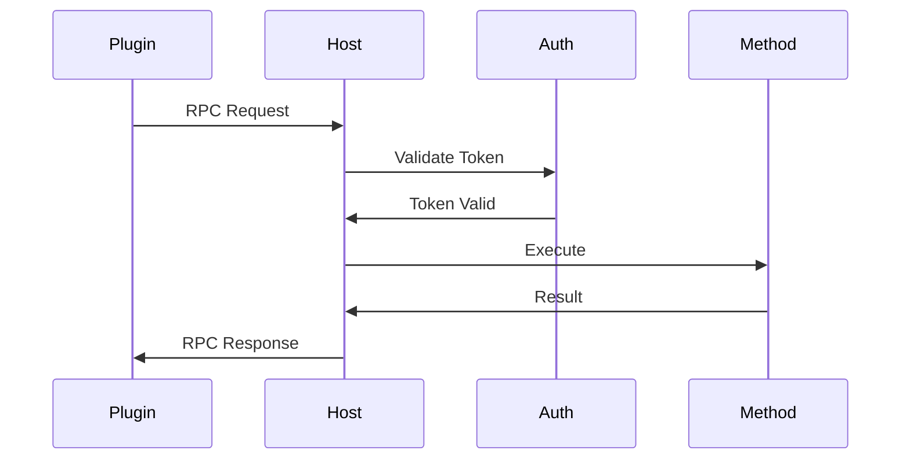

# 插件系统架构设计

## 整体架构

整个插件系统由以下核心组件构成:

### 1. 插件管理器 (Plugin Manager)
核心协调组件，负责:
- 插件的生命周期管理
- 状态管理和持久化
- 插件间依赖管理
- 版本控制
- 资源限制执行

### 2. 安全沙箱 (Sandbox)
提供插件运行的隔离环境:
- IFrame 容器隔离
- Shadow DOM UI 隔离
- CSP 策略控制
- 资源使用限制
- 错误隔离和恢复

### 3. 通信层 (Communication)
处理插件间及插件与宿主的通信:
- IPC 消息总线
- RPC 远程调用
- 消息加密和验证
- 流量控制
- 错误处理

### 4. 监控系统 (Monitoring)
实时监控插件运行状态:
- CPU/内存使用率
- 性能指标收集
- 错误日志记录
- 健康状态检查
- 告警触发

### 5. 插件商店 (Plugin Store)
管理插件的分发和更新:
- 插件发布和安装
- 版本管理
- 依赖解析
- 更新推送
- 安全审核

## 核心模块设计

### 1. 插件生命周期

```typescript
interface PluginLifecycle {
  // 安装阶段
  beforeInstall(): Promise<void>
  install(): Promise<void>
  afterInstall(): Promise<void>
  
  // 初始化阶段
  load(): Promise<void>
  enable(): Promise<void>
  
  // 运行时
  start(): Promise<void>
  stop(): Promise<void>
  
  // 清理阶段
  disable(): Promise<void>
  uninstall(): Promise<void>
}
```

### 2. 插件清单

```typescript
interface PluginManifest {
  // 基本信息
  id: string
  name: string
  version: string
  description?: string
  
  // 入口点
  entry: {
    main: string
    worker?: string
    styles?: string[]
  }
  
  // 权限和依赖
  permissions: string[]
  dependencies: Record<string, string>
  
  // 资源限制
  resources: {
    cpu: number
    memory: number
    storage: number
  }
  
  // API 定义
  api: {
    exports: string[]
    imports: string[]
  }
}
```

### 3. 安全策略

```typescript
interface SecurityPolicy {
  // CSP 配置
  csp: {
    defaultSrc: string[]
    scriptSrc: string[]
    connectSrc: string[]
    styleSrc: string[]
    imgSrc: string[]
  }
  
  // 沙箱配置
  sandbox: {
    allowPopups: boolean
    allowModals: boolean
    allowForms: boolean
    allowDownloads: boolean
  }
  
  // 权限控制
  permissions: {
    storage: boolean
    network: boolean
    notifications: boolean
    clipboard: boolean
  }
}
```

## 通信机制

### 1. IPC 消息格式

```typescript
interface IPCMessage {
  type: 'request' | 'response' | 'event'
  channel: string
  payload: any
  metadata: {
    id: string
    timestamp: number
    source: string
    target: string
  }
  security: {
    token: string
    signature: string
  }
}
```

### 2. RPC 调用流程



## 状态管理

### 1. 插件状态

```typescript
interface PluginState {
  // 运行状态
  status: 'installing' | 'running' | 'stopped' | 'error'
  health: 'healthy' | 'warning' | 'critical'
  
  // 资源使用
  resources: {
    cpu: number
    memory: number
    storage: number
  }
  
  // 性能指标
  metrics: {
    requestCount: number
    errorCount: number
    responseTime: number
  }
}
```

### 2. 状态持久化

- 使用 IndexedDB 存储插件数据
- 定期快照保存
- 启动时自动恢复
- 版本控制和迁移

## 监控和调试

### 1. 监控指标

- 系统级指标
  - CPU 使用率
  - 内存使用
  - 网络流量
  
- 业务级指标
  - 请求响应时间
  - 错误率
  - 并发连接数

### 2. 调试功能

- 远程调试协议
- 断点和单步执行
- 变量检查
- 日志查看
- 网络请求分析

## 安全考虑

1. 沙箱隔离
2. 通信加密
3. 权限控制
4. 资源限制
5. 错误隔离
6. 代码签名
7. 依赖审核

## 开发工具

1. Plugin SDK
2. 类型定义
3. 调试工具
4. 文档生成
5. 测试框架